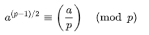
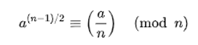
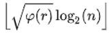

#  Literary Review (A07) - Semeion Stafford
##  Primality Tests
### Overview
----------------------------------------------------------------------

This program lit review is a brief examination of various methods of finding and verifying prime numbers using bother deterministic and non-deterministic methods. The three categories are Certification, Compositeness, and Deterministic.

----------------------------------------------------------------------

## Certification
### Pratt Certificates Primality Test
The Pratt certificate was the first to introduce this model of primality certificates. Although the general idea had been established for some time, Pratt developed this new concept based on the converse of Fermat’s Little Theorem *(Lehmer's Theorem)*. He established that the primality heuristic based on Lehmer’s theorem could be made a non-deterministic function if it is applied recursively to factors of *(n – 1)*, proving that the resulting tree demonstrates that prime factorization is in the complexity class NP. This means that It is solvable in polynomial time by a nondeterministic Turing machine. A Pratt certificate essentially proves that a number a is a primitive root of the multiplicative group *(mod p)*. Pratt’s concept establishes the fact that a has order p-1, proves that p is a prime. This requires knowledge of the prime factorization of *n-1*, and is normally used for small numbers (less than ~ 1,000,000,000).

### Atkin–Goldwasser–Kilian–Morain Certificates Primality Test
As discussed above, Pratt certificate generation is inefficient for larger numbers. In order to avoid this issue and provide more effective certificate generation, a theory based on elliptic curves was developed by Shafi Goldwasser and Joe Kilian. A. O. L. Atkin and François Morain subsequently used this concept as a basis for Atkin-Goldwasser-Kilian-Morain certificates. These certificates are generated and verified by elliptic curve primality testing techniques. This primality certificate is recursive and it consist of:
	An elliptic curve, **C**, y2 = x3 + g2x + g3 (mod p) for some numbers g2 and g3
	A prime q with q > (p1/4 + 1)2, such that for some other number k and m = kq with k != 1.
	Each q has its recursive certificate following it. So, if the smallest q is known to be Prime, all the numbers are certified Prime up the chain.

This method is fitting for generating certified large random primes and is an important component in cryptography functions such as proving the validity of RSA keys.

## Compositeness
### Fermat Primality Test Primality Test
The Fermat primality test is based on Fermat’s little theorem and modular exponentiation. Fermat's Little Theorem states that if a is relatively prime to a prime number p, then
 *p – 1 ≡ 1 mod p*. Efficiency was not a key concern, and the method uses probability in determining possible primes. A method always returns true if a given number is prime. A non-prime, or composite number may return true or false, but the probability of producing incorrect result for composite is low and can be reduced by doing more iterations.

### Rabin-Miller Primality Test
This test is similar to the Fermat (because it is a probabilistic method) and Solovay-Strassen primality test given that it depends on an equality or set of equalities that are true for prime values. This test however is preferred to Fermat. It then verifies whether or not they hold for a number that we want to test for primality. In a deeper context, using the claim that n is prime if and only if the solutions of x2 = 1 (mod n) are x = ±1.
If an-1 = 1, then this implies n qualifies by means of the Fermat test and we also check an - 1/2 = ±1 because it is a square root of one. The test picks a random a∈Zn. If the above sequence does not begin with 1, or the first member of the sequence that is not 1 is also not -1 then n is not prime.

### Solovay–Strassen Primality Test
This test is also a probabilistic test to determine whether a number is possibly prime or composite. This is opposed to a test which would indicate definite primness or compositeness. Given of the time taken to do multiple checks in an exact test, the method instead aims to check if there is a high probability of a number being prime. In terms of its accuracy, if the input is prime, the output will definitely be probably prime, else, the output could incorrectly probable prime. This test is also used in RSA cryptosystem applications.

Using Euler’s proof that for any prime number p and any integer a, 

  where a/p is the Legendre symbol.

Given an odd number n we can contemplate whether or not the congruence 
  holds for various values of the "base" *a*, given that a is relatively prime to n. If n is prime then this congruence is true for all a. After picking random values and testing the congruence, when an a is not compatible with the congruence, we can deduce that the n is not prime.

## Deterministic
### Adleman–Pomerance–Rumely Primality Test
This is a deterministic primality test that utilizes arithmetic in cyclotomic fields to test the primality of an integer n. The O complexity of this test is (log n)O(c log log log n) for some *c > 0*. This test therefore almost works in polynomial time and the complexity previously stated stand for all large n. The algorithm is built on the basis that for any n, there is a collection on pseudo-primality tests such that if n passes all the tests, its divisors lie in a small, explicitly given set. 
This concept expands on Miller’s primality test which guarantees primality or compositeness. Cohen and Lenstra streamlined the idea in 1984, and it was the first primality test that could consistently handle numbers of hundreds of decimal digits.

### Miller’s Primality Test
This test is a deterministic version of Miller-Rabin’s algorithm. We do so by testing all likely a below a specific limit. The problem in general is to set the limit so that the test is still reliable. It was superseded by the AKS primality test. This test is not used in practice, because using the Miller-Rabin test gives a better approximation and efficiency.

### AKS primality test
This algorithm was the first that could provably determine the primality of a number within polynomial time. Additionally, the algorithm does not depend on any mathematical inferences or generalized Riemann hypothesis. Interestingly, this algorithm can be concurrently general, polynomial, deterministic, and unconditional. The test is also built on an identity centered on Fermat’s Little Theorem. This identity was then the basis for a randomized polynomial-time algorithm. 
The AKS primality test is based upon the following theorem: An integer n greater than 2 is prime if and only if the polynomial congruence relation
(x + a)n ≡ (xn + a) (mod n) holds for some a coprime to *n*.

Given an input integer n > 1, the algorithm;
	Check if n is a perfect power: if n = ab for integers a > 1 and b > 1, output composite.
	Find the smallest r such that ordr(n) > (log2n)2. (if r and n are not coprime, then skip this r)
	For all 2 ≤ a ≤ min (r, n−1), check that a does not divide n: If a|n for some 2 ≤ a ≤ min (r, n−1), output composite.
	If n ≤ r, output prime.
	For a = 1 to  do if (X+a)n ≠ Xn+a (mod Xr − 1,n), output composite;
	Output Prime

## Sources
Adleman, L., Pomerance, C., & Rumely, R. (1983). On Distinguishing Prime Numbers from Composite Numbers. Annals of Mathematics, 117(1), second series, 173-206. doi:10.2307/2006975

Cohen, H., & Lenstra, H. (1984). Primality Testing and Jacobi Sums. Mathematics of Computation, 42(165), 297-330. doi:10.2307/2007581

Pomerance, C. (1987). Very Short Primality Proofs. Mathematics of Computation, 48(177), 315-322. doi:10.2307/2007892

https://mathworld.wolfram.com/
